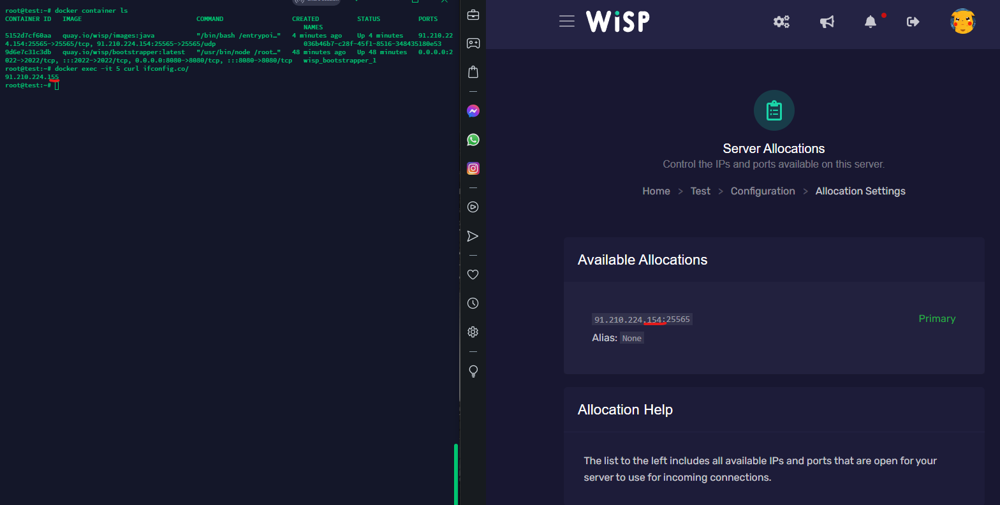
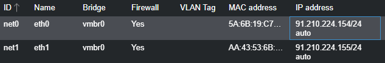

# Advanced Docker networking
This guide shows how to configure a second outgoing IP for specific docker containers.

## !!Warnings!!
You should NOT use this unless you really need to.

You should NOT use this unless you really know what you're doing'

This method could lock you out if you do it wrong.

This method will disconnect your containers while you set it up also you will have to restart every server.

This will be way harder to setup if you use gre tunneling or other kind of proxying.

## My Setup
This guide is for Ubuntu 20.04



.155 will be used as default IP

.154 will be used as second IP

As UUID I will use ef250082-47f3-4297-abe5-580c086bed01 (you only need the UUID from the server you want to use your second IP), you might have more than one but that's completely fine.
You can find the UUID at the admin area.


Also I use the default wisp config if you have changed any network related stuff this might not work properly.

This guide is written for root.

This guide might not work with every game.

If you have more than 2 IPs you will have to rewrite some parts of this guide but it should be clear enough.

Lastly this guide uses iptables so you will need to have it enabled! However it won't cover basic iptables setup, you will have to open your ports yourself!

## Setting up a custom docker network

Firstly we will have to disable dockers masquerade feature. We will do it with creating a custom docker network for wisp.

```
docker network create --attachable --opt ‘com.docker.network.bridge.name=wisp_msq’ --opt ‘com.docker.network.bridge.enable_ip_masquerade=false’ wisp_msq
```


Alright, so we created our network named "wisp_msq", now we need to tell wisp what network to use.

To establish this we are gonna open the wisp config.
```
nano /var/lib/wisp/daemon/config/wisp.yaml
```
We need to change docker.network.name to wisp_msq


now save the file and restart wisp with

```
wisp restart
```
However afterwards we will have to manually trigger a rebuild and restart every server on that node.


Now lets see if that worked.
Use the command
```
docker inspect ef250082-47f3-4297-abe5-580c086bed01 -f "{{json .NetworkSettings.Networks }}"
```
replace ef250082-47f3-4297-abe5-580c086bed01 with one of your UUIDs

The network should ne be changed to wisp_msq


## Setup DNS resolving

Our host needs to know the IP address of the container. Currently docker doesn't support this.

But there are enough GitHub repositories which help us out!

I am gonna use the lightweight [Docker Hoster](https://github.com/dvddarias/docker-hoster).

Docker makes it very easy to install, we just need to run...

```
docker run -d --name=hoster \
    -v /var/run/docker.sock:/tmp/docker.sock \
    -v /etc/hosts:/tmp/hosts \
    dvdarias/docker-hoster
```

now we can ping out container.
```
ping ef250082-47f3-4297-abe5-580c086bed01
```

To make our container auto start on system startup, we need to create a service.

```
nano /etc/systemd/system/docker-hoster.service
```

```
[Unit]
Description=hoster
Requires=docker.service
After=docker.service

[Service]
Restart=always
ExecStart=/usr/bin/docker start -a hoster
ExecStop=/usr/bin/docker stop -t 2 hoster

[Install]
WantedBy=default.target
```

```
systemctl enable docker-hoster.service
```

## iptables postrouting

So we just finished our preparation, but don't worry we are nearly done!

We are gonna actually route our outgoing traffic now.

```
iptables -t nat -I POSTROUTING -s 172.20.0.0/16 ! -o wisp_msq  -j SNAT --to-source 91.210.224.155
```
replace 91.210.224.155 with your main IP.

This will now route all outgoing traffic from our wisp containers(172.20.0.0/16) to our main IP.

Now we are going to route our outgoing traffic for our second IP.
however since the internal IPs aren't sticky we need to make something a bit hacky.

We are going to make a little script which will update our iptables for us.

Create a new file and insert the following

```
nano /spam.sh
```

```
#!/bin/bash

ip="91.210.224.154"
servers=("ef250082-47f3-4297-abe5-580c086bed01")

for server in ${servers[@]}; do
  $(/usr/sbin/iptables -t nat -I POSTROUTING -s $server ! -o wisp_msq  -j SNAT --to-source $ip)
done
```
make sure to replace the IP with your second IP.
And the UUID with your UUID.
If you have multiple UUIDs you can use them like this.
you will need to update that script whenever you add a new server.
If you want it automatically you would need to have to use the API.

```
#!/bin/bash

ip="91.210.224.154"
servers=("ef250082-47f3-4297-abe5-580c086bed01" "ef250082-47f3-4297-abe5-580c086bed02" "ef250082-47f3-4297-abe5-580c086bed03")

for server in ${servers[@]}; do
  $(/usr/sbin/iptables -t nat -I POSTROUTING -s $server ! -o wisp_msq  -j SNAT --to-source $ip)
done
```

Save and exit and make the script runnable.

```
chmod +x /spam.sh
```

Lastly make the script run every minute.

```
crontab -e
```

```
* * * * * /spam.sh
```

That's it!
Time for testing, make sure your server is up and running and use the command

```
docker exec -it ef250082-47f3-4297-abe5-580c086bed01 curl ifconfig.co/
```

(replace the UUID with your UUID)

